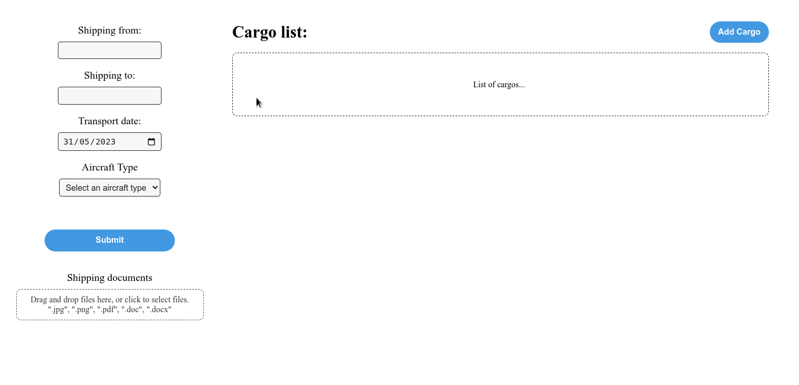
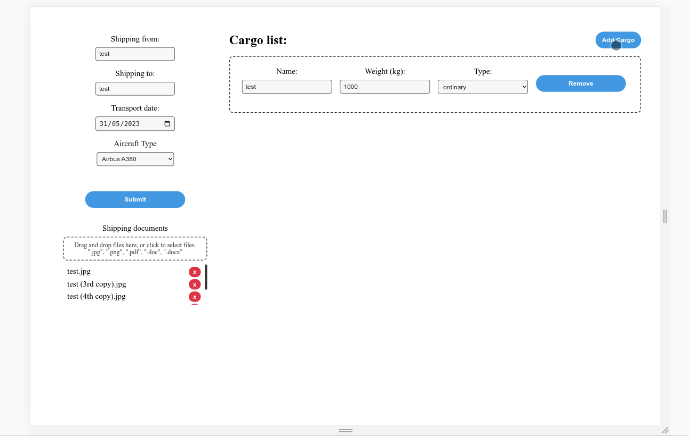

# SkyPaper 📄🛫

## How to Run the App

These instructions will guide you on how to run the app locally.

`Delivered container environment is not suited for a production environment.`

### Prerequisites

Before running the app, make sure you have the following prerequisites installed:

- Docker (version 23.0.6 or higher)
- Docker compose (version 2.17.3 or higher)

### Running the App

1. Execute the following command:
``` shell
  docker compose up
``` 
   * `It takes a long time to start the nginx server, so make sure the dev-skypaper-backend console shows "NOTICE: ready to handle connections".`

2. Open a web browser and navigate to the provided URL (e.g., http://localhost:3000) to access the app.

### Stopping the App
To stop the running app, you can press `Ctrl + C` in the terminal where the app is running. This will terminate the server and stop the app.

## What was done
* [x] Do wynkonania: 
  * [x] Strona powinna być responsywna.
  * [x] Formularz transportu:
    * [x] Powinien składać się z następujący pól:
      * [x] Transport z (pole tekstowe, wymagane)
      * [x] Transport do (pole tekstowe, wymagane)
      * [x] Typ samolotu (możliwość wybrania jednego z dwóch rodzajów, wymagane)
        * [x] Ograniczenia do wartości: Airbus A380, Boeing 747
      * [x] Dokumenty przewozowe ( Drag&Drop na pliki, opcjonalne)
        * [x] Ograniczenia do typu pliku: jpg, png, doc, docx, pdf
      * [x] Data transportu (możliwość wyboru daty z kalendarza, pole wymagane)
        * [x] Transport może się odbywać tylko i wyłącznie od poniedziałku do piątku.
    * [x] Może zawierać 1 lub wiele towarów.
      * [x] Pola dla kolejnego ładunku powinny być dodawane dynamicznie przez użytkownika np. za pomocą przycisku „Dodaj” kolejny ładunek.
      * [x] Pola dla pojedynczego ładunku:
        * [x] Nazwa ładunku (pole tekstowe, wymagane)
        * [x] Ciężar ładunku w kg (pole liczbowe, wymagane)
          * [x] Pojedynczy ładunek nie może przekraczać maksymalnego ciężaru w zależności od wybranego typu samolotu. 
            * [x] Ograniczenia do wartości: Airbus A380 ( 35 ton ), Boeing 747 ( 38 ton )
        * [x] Typ ładunku (możliwość wybrania jednego z dwóch rodzajów, pole wymagane)
          * [x] Ograniczenia do wartości: ładunek zwykły, ładunek niebezpieczny

* [ ] Dodatkowe:
  * [ ] Dodatkowo informacje o transporcie powinny zostać zamodelowane w Pimcore oraz zapisywać się jako DataObjecty.
  * [ ] Wysłanie formularza w zależności od typu samolotu na odpowiadający mu email.
  * [ ] Wiadomość powinna zawierać w załączniku:
    * [ ] Dane z formularza transportu
    * [ ] Tabelę z listą towarów zgłoszonychdo transportu,

## Visualization

Field validation:


Completed form:


Responsiveness:

